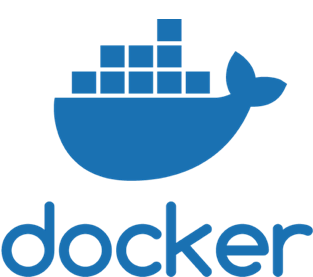
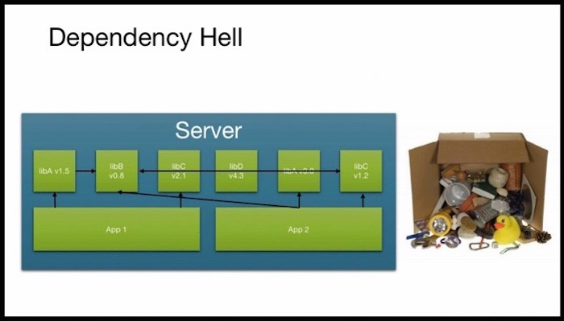
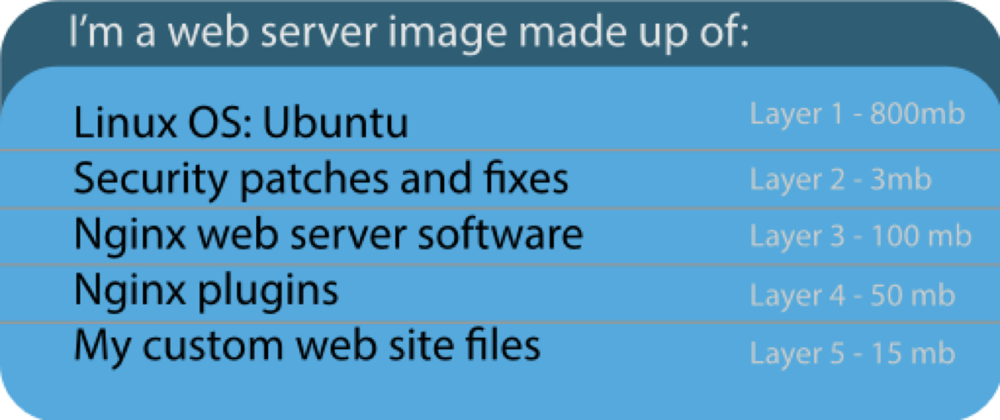
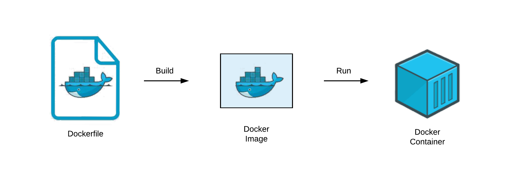

layout: true

.signature[@algogrit]

---

class: center, middle



### Fundamentals

Gaurav Agarwal

---

# Agenda

- Docker is AWESOME!

---
class: center, middle


Software Engineer & Product Developer

Principal Consultant & Founder @ https://agarwalconsulting.io

ex-Tarka Labs, ex-BrowserStack, ex-ThoughtWorks

---

# Class Introduction

- Quick Poll
- Your background
  - Experience with Docker/K8s?
  - Your expectations?

---
class: center, middle

# Defining the problem

---

class: center, middle

## Building an application using microservice

---
class: center, middle

### [12 Factor](https://12-factor-apps.slides.algogrit.com/) Apps

---
class: center, middle

## Dependency Hell

---
class: center, middle



.image-credits[https://blog.newrelic.com/technology/app-centric-docker-monitoring-webinar/attachment/dependency-hell/]

---
class: center, middle

### Solution?

---
class: center, middle

# Enter Docker

---

## Comparison

### VM vs Containers


.image-credits[https://www.youtube.com/watch?v=TvnZTi_gaNc]

---

### Hypervisor vs Containers


.image-credits[https://www.docker.com/blog/containers-replacing-virtual-machines/]

---
class: center, middle

## Under the hood

---
class: center, middle

*LXC (Linux Containers) is an operating-system-level virtualization method for running multiple isolated Linux systems (containers) on a control host using a **single Linux kernel**.*


.content-credits[https://en.wikipedia.org/wiki/LXC]
.image-credits[https://en.wikipedia.org/wiki/LXC]

---
class: center, middle

*An industry-standard container runtime with an emphasis on simplicity, robustness and portability.*


.content-credits[https://containerd.io/]

---
class: center, middle

*A new upstream project to break up Docker into independent components...*


.content-credits[https://www.docker.com/blog/introducing-the-moby-project/]

---

## Installation and Setup

- Docker for [Mac](https://docs.docker.com/docker-for-mac/install/), [Windows](https://docs.docker.com/docker-for-windows/install/) or [Engine](https://docs.docker.com/engine/install/), Linux-only!

```docker
docker run docker.io/hello-world
```

---

## Primer


.image-credits[https://docs.docker.com/engine/docker-overview/]

---
class: center, middle

### Docker Engine

---
class: center, middle


.image-credits[https://docs.docker.com/get-started/overview/]

---
class: center, middle

### Containers

---
class: center, middle


---

- Using `docker run`, to start a container
- Using `docker ps`, to view status of containers
- Using `docker stop`, to stop a container
- Using `docker rm`, to remove a stopped container

---
class: center, middle

#### Exercise: Run a linux container, create a file inside it and stop it

---
class: center, middle

Containers are *ephemeral*

---
class: center, middle

### Images

---

#### Key concepts

- Image is the definition of what a **container** is created from.
- Images are **immutable**. If you make changes, a new image must be built.
- Images are made of **layers**.
- Images are **inherited** from **base images** and can be many levels deep.
- `docker images`

.content-credits[https://www.vergeops.com/]

---

#### Creating an image

- From a [running container](https://docs.docker.com/engine/reference/commandline/commit/)...
  - `docker commit`

---
class: center, middle

or

---
class: center, middle

### Dockerfile

Or `dockerfile`, `my-dockerfile`, ...

---

- Use `Dockerfile`
  - *Infrastructure as Code*
  - All images are based on other images as their parent.
  - You must choose a parent, or `FROM` image.
  - `scratch` is the base empty image supplied by Docker.
  - Base images include all settings, files, what command runs at startup, etc.
- Create an image using
  - `docker build`

---

Here is the format of the `Dockerfile`:

```Dockerfile
# Comment
INSTRUCTION arguments
```

---

Eg. [`hello-world`'s `Dockerfile`](https://hub.docker.com/_/hello-world)

```bash
cat Dockerfile
```

```dockerfile
FROM scratch
COPY hello /
CMD ["/hello"]
```

---

#### Other Commands

There are just a handful of simple `Instructions`:

```bash
FROM # which image this inherits from
LABEL # custom information
WORKDIR # Change to a directory until changed again.
  # Works like cd
USER # Change to a user
RUN # Run a Linux command in a new layer.
  # The command is dependent on which shell is in the image.
EXPOSE # Tells what ports this container will listen on.
  # Does not actually publish a port, but is rather like documentation.
ADD # copy files into the container
COPY # copy files into the container.
  # Similar to ADD
ENTRYPOINT # The command to be run when container is started.
  # This is inherited from a base image.
CMD # provides defaults to be run after the ENTRYPOINT.
  # Also inherited from the base image.
```

[More...](https://docs.docker.com/engine/reference/builder/)

---

#### Layers

- Images are made of **layers**.
- Each instruction in a `Dockerfile` adds a layer.
- When pushing/pulling an image to a repository (more to come), only the **changed layers** are pushed to save bandwidth.

---
class: center, middle



.image-credits[https://www.vergeops.com/]

---

#### Image Tags

- You can uniquely identify an image using a tag name
- `docker build -t <image-name>:<tag-name> .`
- `latest` is the default tag name

---
class: center, middle

#### Exercise: Create a `hello-world` image, similar to [`hello-haskell`](https://github.com/AgarwalConsulting/DockerTraining/tree/master/examples/0-hello-world/hello-haskell)

---
class: center, middle



.image-credits[https://ekababisong.org/docker-kubeflow-for-poets/]

---
class: center, middle

### Registry

---

- Many options: Docker Hub, AWS ECR, GCP Container Registry, ...
- Default: https://hub.docker.com/
- Private repository...

---

#### Pulling from a repository

`docker pull hello-world`

---

#### Pushing to a repository

`docker push <image-name>:<tag-name>`

---
class: center, middle

#### Exercise: [Push the `hello-world` image to hub](https://github.com/AgarwalConsulting/DockerTraining/blob/master/challenges/pushing-to-remote-repo.md), ask a participant to run it on their system

---
class: center, middle

#### Optional: [Deploying a private repo](https://docs.docker.com/registry/deploying/)

---
class: center, middle

### Docker cli - Beyond `build` & `run`

---

#### cli: Containers

- ps
- rm
- start
- stop
- kill
- cp

---

#### cli: Images

- commit
- build
  - Flag: --build-arg
- images
- rmi
- push
- pull
- tag

---

### `docker run` - Advanced

- run
  - Commonly used flags: -d, -p, -it, --name, -e, -v
- Environment
- Ports
- Volumes
- [Restart Policy](https://docs.docker.com/engine/reference/run/#restart-policies---restart)

---
class: center, middle

#### Exercise: [Nginx Lab](https://github.com/AgarwalConsulting/DockerTraining/blob/master/challenges/nginx-simple.md)

---
class: center, middle

#### Exercise: [Running a DB within Docker](https://github.com/AgarwalConsulting/DockerTraining/blob/master/challenges/run-a-db.md)

---

### Basic Tips

- Single process per container
- Use volumes to persist data between restarts
  - any thing within the container will be thrown away when the container is stopped

---
class: center, middle

## Advanced

---
class: center, middle

### Debugging

---

- docker `logs`
- docker `attach` for interactive logs
  - detach using: `CTRL` + `p`, `q`
- docker `exec`
- docker `export`
  - to dump running container's filesystem into an `.tar` file
- docker `diff`
  - A = added
  - C = changed
  - D = deleted
- docker `inspect`
- docker `stats`
- `docker top <container-name>`
- docker `history`

---
class: center, middle

#### Exercise: Debug [`gauravagarwalr/spring-greeting`](https://github.com/AgarwalConsulting/DockerTraining/blob/master/challenges/debug-exercise.md)

---
class: center, middle

### docker cli - Levelling up

---

- Containers
  - docker `kill`
  - docker `pause`/`unpause`
  - docker `rename`
  - docker `restart`
  - docker `update`
    - `--restart always` nginx
  - docker `container prune`
- Images
  - docker `rmi`
  - docker `tag`
  - docker `save`
  - docker `load`

---
class: center, middle

### Minimizing the image size

---

- Use a tiny start image
  - alpine
  - ubuntu minimal
  - debian slim
  - ...

---
class: center, middle

or

---
class: center, middle

Multi Stage builds

---
class: center, middle

### Docker Networking

---

- `docker network`
  - `ls`
  - `inspect <name>`
  - `create <name>`
  - `connect <name> <container-id>`
    - `--network <name>`

---
class: center, middle

#### Exercise: [Spring Greeting](https://github.com/AgarwalConsulting/DockerTraining/blob/master/challenges/greeting-service.md)

---
class: center, middle

### Orchestrating your containers

---
class: center, middle

### Alternatives to docker

---

### Advanced Tips

- Avoid using the `root` user
- Linting
  - [`hadolint`](https://github.com/hadolint/hadolint)

---
class: center, middle

Code
https://github.com/AgarwalConsulting/DockerTraining

Slides
https://docker.slides.agarwalconsulting.io
