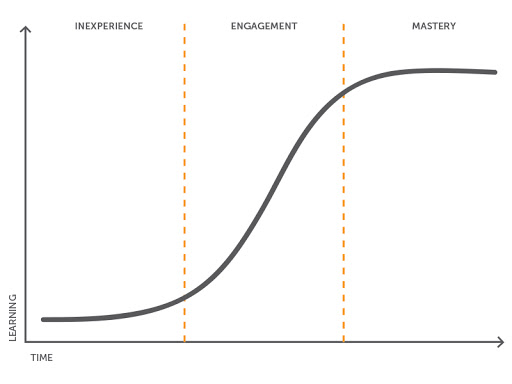
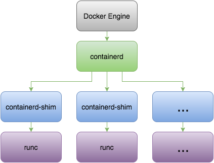
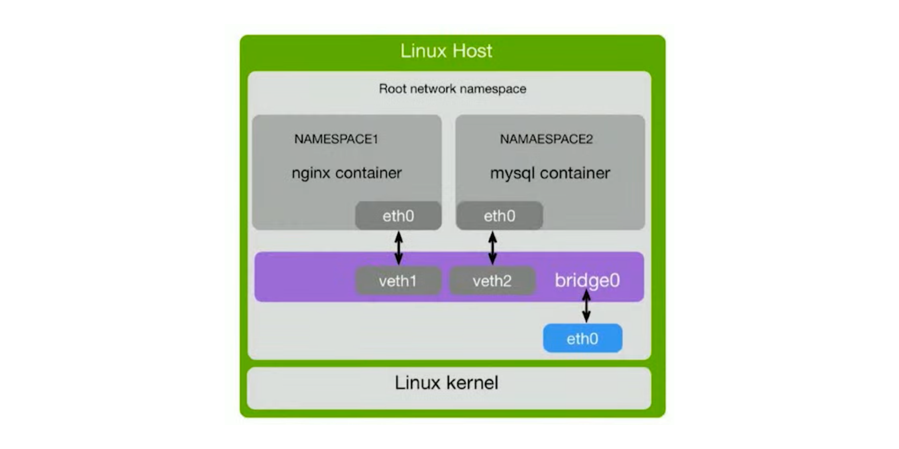
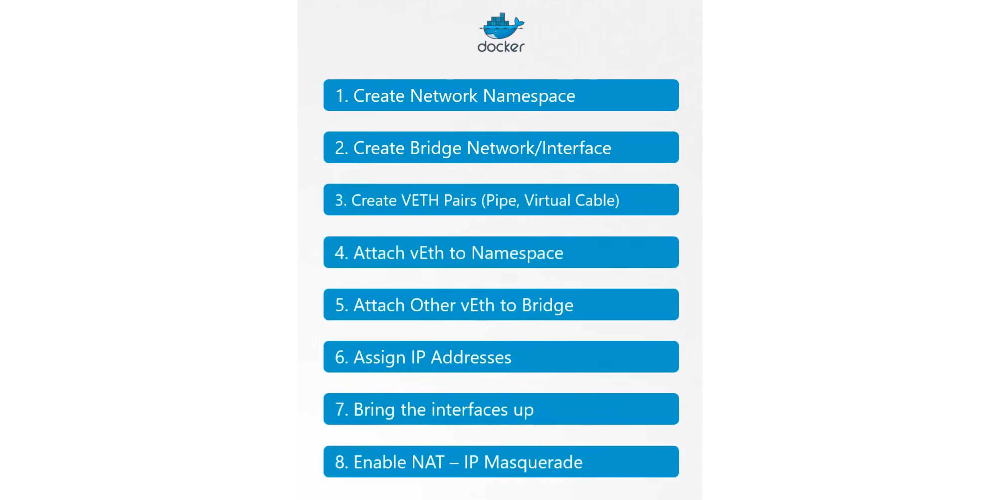
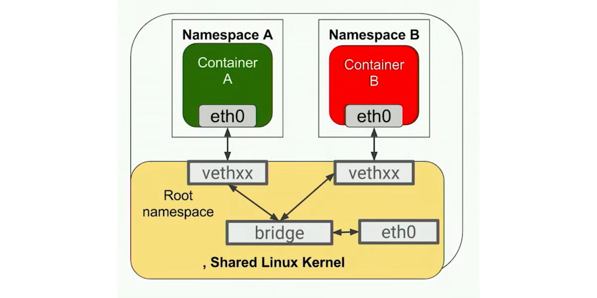
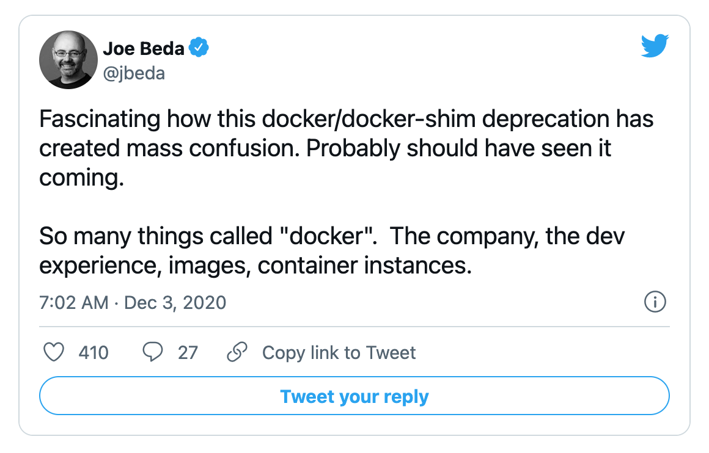
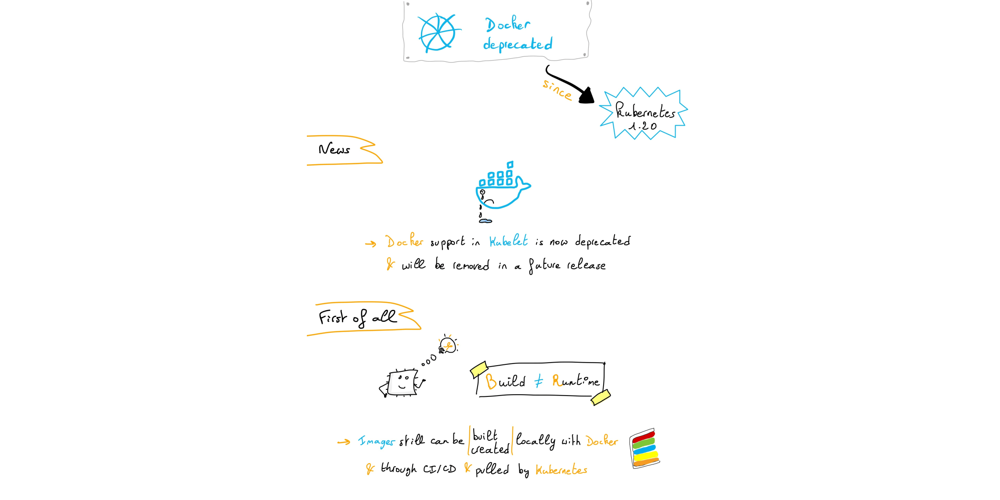
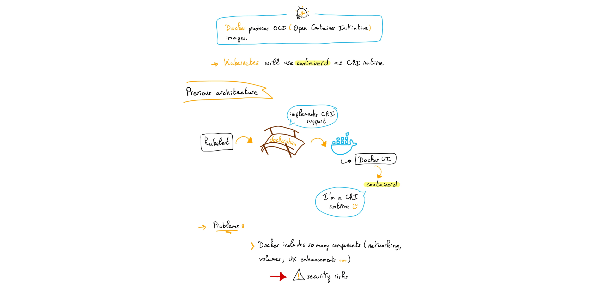
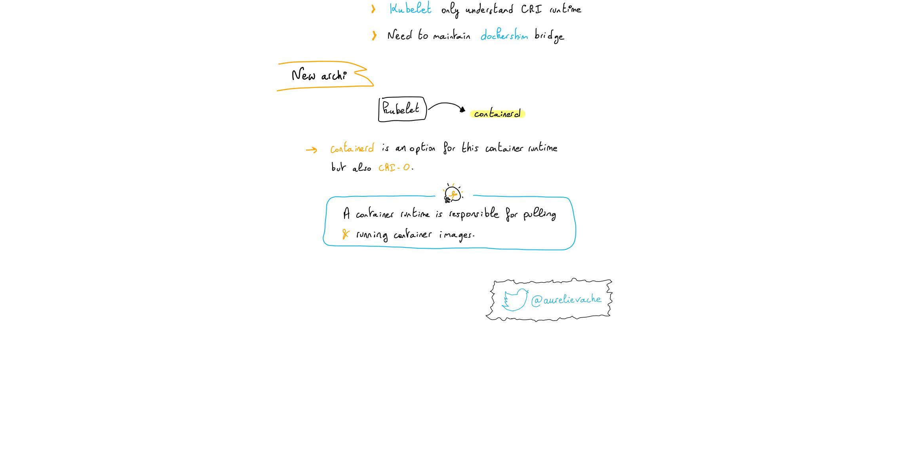
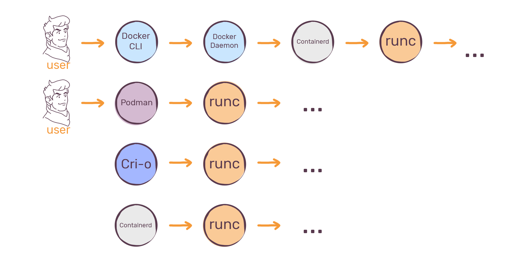

layout: true

.signature[@algogrit]

---

class: center, middle


# Fundamentals

Gaurav Agarwal

---

## Agenda

- Docker is AWESOME!

---

class: center, middle

## Who is this class for?

---

- Application Developers

- SRE & devops engineers

---
class: center, middle

## What are we going to learn?

---
class: center, middle

*Outline*

---
class: center, middle


Software Engineer & Product Developer

Director of Engineering & Founder @ https://codermana.com

ex-Tarka Labs, ex-BrowserStack, ex-ThoughtWorks

---

class: center, middle

Co-organizer of Chennai Go meetup

Volunteer at Golang India - Remote study group

---

class: center, middle

*What we wanted*


---

class: center, middle

*What we got*


---

## As a instructor

- I promise to

  - make this class as interactive as possible

  - use as many resources as available to keep you engaged

  - ensure everyone's questions are addressed

---

## What I need from you

- Be vocal

  - Let me know if there any audio/video issues ASAP

  - Feel free to interrupt me and ask me questions

- Be punctual

- Give feedback

- Work on the exercises

- Be *on mute* unless you are speaking

---
class: center, middle

## Class Progression

---
class: center, middle



---
class: center, middle

Here you are trying to *learn* something, while here your *brain* is doing you a favor by making sure the learning doesn't stick!

---

### Some tips

- Slow down => stop & think
  - listen for the questions and answer

- Do the exercises
  - not add-ons; not optional

- There are no dumb questions!

- Drink water. Lots of it!

---

### Some tips (continued)

- Take notes
  - Try: *Repetitive Spaced Out Learning*

- Talk about it out loud

- Listen to your brain

- *Experiment!*

---
class: center, middle

### 📚 Content ` > ` 🕒 Time

---
class: center, middle

## Show of hands

*Yay's - in Chat*

---
class: center, middle

## Defining the [problem](https://github.com/AgarwalConsulting/DockerTraining/blob/master/Problem.md)

---

class: center, middle

### Building an application in a microservice architecture

---
class: center, middle

#### [12 Factor](https://12-factor-apps.slides.algogrit.com/) Apps

---
class: center, middle

### Dependency Hell

---
class: center, middle


.image-credits[https://blog.newrelic.com/technology/app-centric-docker-monitoring-webinar/attachment/dependency-hell/]

---
class: center, middle

### Solution?

---
class: center, middle

## Enter Docker

---

## Comparison

### VM vs Containers


.image-credits[https://www.weave.works/blog/a-practical-guide-to-choosing-between-docker-containers-and-vms]

---

### Hypervisor vs Containers


.image-credits[https://www.docker.com/blog/containers-replacing-virtual-machines/]

---
class: center, middle

### Before we begin...

---
class: center, middle

[Docker Inc.](https://www.docker.com/company)

.content-credits[https://en.wikipedia.org/wiki/Docker,_Inc.]

---
class: center, middle

*A new upstream project to break up Docker into independent components...*


.content-credits[https://www.docker.com/blog/introducing-the-moby-project/]

---
class: center, middle

*Open Container Initiative* (OCI) is an open governance structure for the express purpose of creating open industry standards around container formats and runtimes.


.content-credits[https://opencontainers.org/]

---
class: center, middle

[OCI Runtime Specification](https://github.com/opencontainers/runtime-spec)

The Open Container Initiative develops specifications for standards on Operating System process and application containers.

.content-credits[https://github.com/opencontainers/runtime-spec/blob/master/spec.md]

---
class: center, middle

### Docker: under the hood

---
class: center, middle


---
class: center, middle

*An industry-standard container runtime with an emphasis on simplicity, robustness and portability.*


.content-credits[https://containerd.io/]

---
class: center, middle

*containerd* manages the complete container lifecycle of its host system, from image transfer and storage to container execution and supervision to low-level storage to network attachments and beyond.

---
class: center, middle

[*runC*](https://github.com/opencontainers/runc)

is a CLI tool for spawning and running containers according to the *OCI specification*.

.content-credits[https://www.docker.com/blog/runc/]

---
class: center, middle


.image-credits[https://mkdev.me/en/posts/the-tool-that-really-runs-your-containers-deep-dive-into-runc-and-oci-specifications]

---
class: center, middle

*Libcontainer* provides a native Go implementation for creating containers with namespaces, cgroups, capabilities, and filesystem access controls. It allows you to manage the lifecycle of the container performing additional operations after the container is created.

.content-credits[https://github.com/opencontainers/runc/tree/master/libcontainer]

---
class: center, middle



.image-credits[https://blog.ippon.tech/docker-engine-1-11-understanding-runc/]

---

## Installation and Setup

- Docker for [Mac](https://docs.docker.com/docker-for-mac/install/), [Windows](https://docs.docker.com/docker-for-windows/install/) or [Engine](https://docs.docker.com/engine/install/), Linux-only!

```docker
docker run docker.io/hello-world
```

---

## Primer


.image-credits[https://docs.docker.com/engine/docker-overview/]

---
class: center, middle

### Docker Engine

---
class: center, middle


.image-credits[https://docs.docker.com/get-started/overview/]

---
class: center, middle

### Containers

---
class: center, middle


---

- Using `docker run`, to start a container

- Using `docker ps`, to view status of containers

- Using `docker stop`, to stop a container

- Using `docker rm`, to remove a stopped container

---
class: center, middle

#### Exercise: Run a linux container, create a file inside it and stop it

---
class: center, middle

Containers are *ephemeral*

---
class: center, middle

### Images

---

#### Key concepts

- Image is the definition of what a **container** is created from.

- Images are **immutable**. If you make changes, a new image must be built.

- Images are made of **layers**.

- Images are **inherited** from **base images** and can be many levels deep.

- `docker images`

.content-credits[https://www.vergeops.com/]

---

#### Creating an image

- From a [running container](https://docs.docker.com/engine/reference/commandline/commit/)...

  - `docker commit`

---
class: center, middle

or

---
class: center, middle

### Dockerfile

Or `dockerfile`, `my-dockerfile`, ...

---

- Use `Dockerfile`

  - *Infrastructure as Code*

  - All images are based on other images as their parent.

  - You must choose a parent, or `FROM` image.

  - `scratch` is the base empty image supplied by Docker.

  - Base images include all settings, files, what command runs at startup, etc.

- Create an image using

  - `docker build`

---

Here is the format of the `Dockerfile`:

```Dockerfile
# Comment
INSTRUCTION arguments
```

---

Eg. [`hello-world`'s `Dockerfile`](https://hub.docker.com/_/hello-world)

```bash
cat Dockerfile
```

```dockerfile
FROM scratch
COPY hello /
CMD ["/hello"]
```

---

#### Other Commands

There are just a handful of simple `Instructions`:

```bash
FROM # which image this inherits from
LABEL # custom information
WORKDIR # Change to a directory until changed again.
  # Works like cd
USER # Change to a user
RUN # Run a Linux command in a new layer.
  # The command is dependent on which shell is in the image.
EXPOSE # Tells what ports this container will listen on.
  # Does not actually publish a port, but is rather like documentation.
ADD # copy files into the container
COPY # copy files into the container.
  # Similar to ADD
ENTRYPOINT # The command to be run when container is started.
  # This is inherited from a base image.
CMD # provides defaults to be run after the ENTRYPOINT.
  # Also inherited from the base image.
```

[More...](https://docs.docker.com/engine/reference/builder/)

---

#### Layers

- Images are made of **layers**.

- Each instruction in a `Dockerfile` adds a layer. (*True* for older Docker installations)

- When pushing/pulling an image to a repository (more to come), only the **changed layers** are pushed to save bandwidth.

---
class: center, middle

Only the instructions *RUN, COPY, ADD* create layers.

.content-credits[https://docs.docker.com/develop/develop-images/dockerfile_best-practices/]

---

- Other instructions create temporary intermediate images, and do not increase the size of the build.

- When building an image, Docker steps through the instructions in your Dockerfile, executing each in the order specified.

- As each instruction is examined, Docker looks for an existing image in its cache that it can reuse, rather than creating a new (duplicate) image.

.content-credits[https://docs.docker.com/develop/develop-images/dockerfile_best-practices/]

---
class: center, middle


.image-credits[https://www.vergeops.com/]

---

#### Image Tags

- You can uniquely identify an image using a tag name

- `docker build -t <image-name>:<tag-name> .`

- `latest` is the default tag name

---
class: center, middle

#### Exercise: Create a `hello-world` image, similar to [`hello-haskell`](https://github.com/AgarwalConsulting/DockerTraining/tree/master/examples/0-hello-world/hello-haskell)

---
class: center, middle


.image-credits[https://ekababisong.org/docker-kubeflow-for-poets/]

---
class: center, middle

### Registry

---

- Many options: Docker Hub, AWS ECR, GCP Container Registry, ...

- Default: https://hub.docker.com/

- Private repository...

---

#### Pulling from a repository

`docker pull hello-world`

---

#### Pushing to a repository

`docker push <image-name>:<tag-name>`

---
class: center, middle

#### Exercise: [Push the `hello-world` image to hub](https://github.com/AgarwalConsulting/DockerTraining/blob/master/challenges/pushing-to-remote-repo.md), ask a participant to run it on their system

---
class: center, middle

#### Optional: [Deploying a private repo](https://docs.docker.com/registry/deploying/)

---
class: center, middle

### Docker cli - Beyond `build` & `run`

---

#### cli: Containers

- ps

- rm

- start

- stop

- kill

- cp

---

#### cli: Images

- commit

- build
  - Flag: --build-arg

- images

- rmi

- push

- pull

- tag

---

### `docker run` - Advanced

- run
  - Commonly used flags: -d, -p, -it, --name, -e, -v

- Sets
  - Environment

  - Ports

  - Volumes

  - [Restart Policy](https://docs.docker.com/engine/reference/run/#restart-policies---restart)

---
class: center, middle

#### Exercise: [Nginx Lab](https://github.com/AgarwalConsulting/DockerTraining/blob/master/challenges/nginx-simple.md)

---

### Basic Tips

- Single process per container

- Use volumes to persist data between restarts

  - any thing within the container will be thrown away when the container is stopped

---
class: center, middle

## Advanced

---
class: center, middle

### Working with volumes

.content-credits[https://docs.docker.com/storage/]

---

- `docker volume`

  - `docker volume create`

  - `docker volume inspect`

  - `docker volume ls`

  - `docker volume prune`

  - `docker volume rm`

---
class: center, middle

`docker run -v` (or) `docker run --mount`

---
class: center, middle

#### Exercise: [Running a DB within Docker](https://github.com/AgarwalConsulting/DockerTraining/blob/master/challenges/run-a-db.md)

---
class: center, middle

### Debugging

---

- docker `logs`

- docker `attach` for interactive logs
  - detach using: `CTRL` + `p`, `q`

- docker `exec`

- docker `export`
  - to dump running container's filesystem into an `.tar` file

- docker `diff`
  - A = added
  - C = changed
  - D = deleted

- docker `inspect`

- docker `stats`

- `docker top <container-name>`

- docker `history`

---
class: center, middle

#### Exercise: Debug [`gauravagarwalr/spring-greeting`](https://github.com/AgarwalConsulting/DockerTraining/blob/master/challenges/debug-exercise.md)

---
class: center, middle

### docker cli - Levelling up

---

- Containers
  - docker `kill`

  - docker `pause`/`unpause`

  - docker `rename`

  - docker `restart`

  - docker `update`
    - `--restart always` nginx

  - docker `container prune`

---

- Images
  - docker `rmi`

  - docker `tag`

  - docker `save`

  - docker `load`

---
class: center, middle

#### BuildKit

.content-credits[https://docs.docker.com/develop/develop-images/build_enhancements/]

---

- New Docker Build secret information

- Using SSH to access private data in builds

---
class: center, middle

### Minimizing the image size

---

- Use a tiny start image

  - alpine

  - ubuntu minimal

  - debian slim

  - ...

---
class: center, middle

or

---
class: center, middle

Multi Stage builds

---
class: center, middle

### Docker Networking

.content-credits[https://docs.docker.com/network/]

---

- `docker network`

  - `ls`

  - `inspect <name>`

  - `create <name>`

  - `connect <name> <container-id>`
    - `--network <name>`

---

#### Networking drivers

- *bridge*

- *host*

- *none*

- overlay

- macvlan

.content-credits[https://docs.docker.com/network/#network-drivers]

---
class: center, middle

`docker run --network` (or) `docker run --link`

---
class: center, middle

Docker uses the `Container Network Model` specification.

---
class: center, middle

*libnetwork* aims to satisfy that composable need for Networking in Containers.

The goal of *libnetwork* is to deliver a robust *Container Network Model* that provides a consistent programming interface and the required network abstractions for applications.

.content-credits[https://github.com/moby/libnetwork/blob/master/docs/design.md]

---
class: center, middle

#### Exercise: [Spring Greeting](https://github.com/AgarwalConsulting/DockerTraining/blob/master/challenges/greeting-service.md)

---
class: center, middle

#### What happens when I run a container and expose a port?

---
class: center, middle

```bash
docker run -d -p 80:80 nginx
```

---

#### Linux Network Namespaces

Network namespaces is a part of containerization technology that is used by the Linux kernel to provide isolation between containers.

It allows, for example, a container to have its own network stack, its own networking configuration, and its own routing configuration.

---

- The tool that is used to operate with `network ns`: `iproute2`

- Network namespaces are stored in `/var/run/netns`

- There are two types of network namespaces:

  - Root namespace `ip link`
  - Non-root namespace `ip netns .. ip link`

---
class: center, middle



.content-credits[https://www.youtube.com/watch?v=QMNbgmxmB-M]

---
class: center, middle



.content-credits[https://www.youtube.com/watch?v=l2BS_kuQxBA]

---
class: center, middle

Default docker networking mode: Bridge mode

---
class: center, middle

A `Linux bridge` is a virtual implementation of a physical switch inside of the Linux kernel.

It forwards packets between interfaces that are connected to it. It's usually used for forwarding packets on routers, on gateways, or between VMs and *network namespaces* on a host.

It forwards traffic basing itself on MAC addresses, which are in turn discovered dynamically by inspecting traffic.

---
class: center, middle

```bash
bridge add <container-id> /var/run/netns/<namespace>
```

---
class: center, middle



.content-credits[https://www.youtube.com/watch?v=Slce9Nu-NB0]

---
class: center, middle

### Orchestrating your containers

---

- Docker Swarm

- Apache Mesos

- *Kubernetes*

---
class: center, middle



.content-credits[https://twitter.com/jbeda/status/1334309564343177217]

---
class: center, middle



.content-credits[https://dev.to/aurelievache/understanding-kubernetes-part-38-kubernetes-is-deprecating-docker-eh3]

---
class: center, middle



.content-credits[https://dev.to/aurelievache/understanding-kubernetes-part-38-kubernetes-is-deprecating-docker-eh3]

---
class: center, middle



.content-credits[https://dev.to/aurelievache/understanding-kubernetes-part-38-kubernetes-is-deprecating-docker-eh3]

---
class: center, middle

### Alternatives to docker/containerd

---
class: center, middle

*LXC (Linux Containers) is an operating-system-level virtualization method for running multiple isolated Linux systems (containers) on a control host using a **single Linux kernel**.*


.content-credits[https://linuxcontainers.org/]

---

- [Podman](https://podman.io/)

- [CRI-O](https://cri-o.io/)

- [Katacontainers](https://katacontainers.io/)

- [gVisor](https://gvisor.dev/)

- ...

---
class: center, middle



.image-credits[https://mkdev.me/en/posts/the-tool-that-really-runs-your-containers-deep-dive-into-runc-and-oci-specifications]

---

### Advanced Tips

- Linting

  - [`hadolint`](https://github.com/hadolint/hadolint)

- [Security](https://docs.docker.com/engine/security/)

  - Avoid [using the `root` user](https://docs.docker.com/engine/security/rootless/)

  - [Apparmor profiles](https://docs.docker.com/engine/security/apparmor/)

  - [Seccomp profiles](https://docs.docker.com/engine/security/seccomp/)

  - [Isolate containers](https://docs.docker.com/engine/security/userns-remap/)

- Define [resource constraints](https://docs.docker.com/config/containers/resource_constraints/)

---
class: center, middle

Code
https://github.com/AgarwalConsulting/DockerTraining

Slides
https://docker.slides.agarwalconsulting.io
